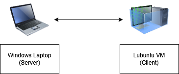

 # Measuring Network Latency and Throughput with **iperf3**

## Obectives
The purpose of this lab was to provide hands-on experience with measuring network performance between two devices using iperf3.

- Download iperf3 for windows laptop to run as the server.
- Setup a VM on VirtualBox running Lubuntu to act as the client.
- Install and configure iperf3 on both systems.
- Measure network latency between the two systems.
- Measure network throughput between the client and server.

## Topology  

