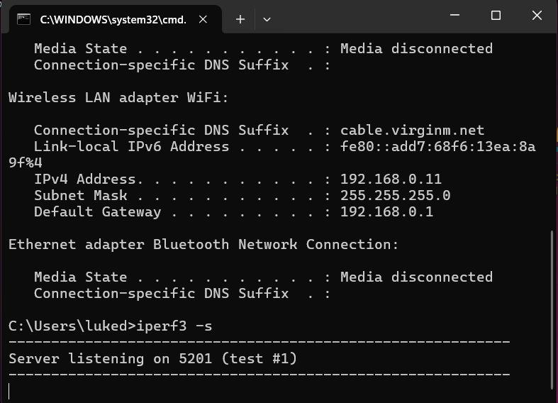
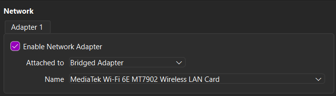
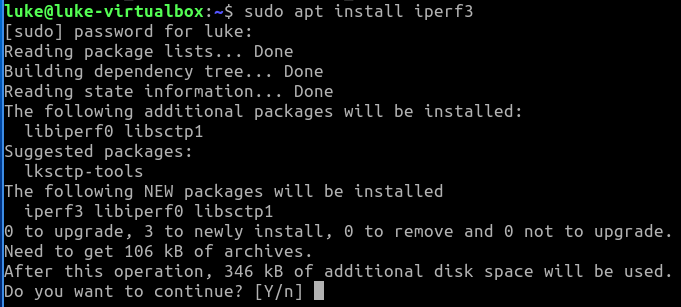
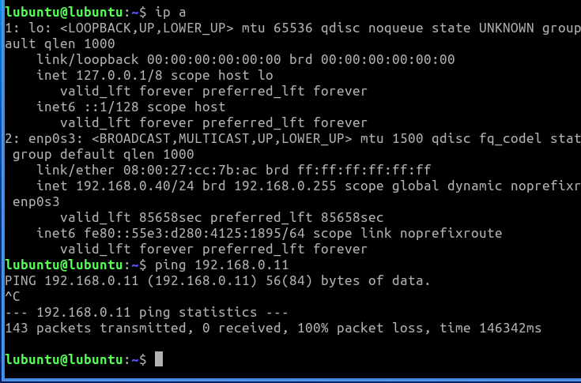
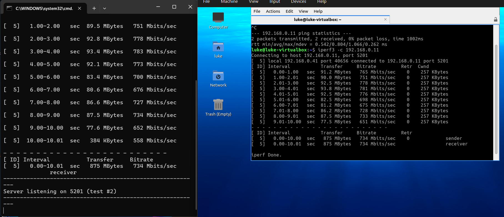

# Measuring Network Latency and Throughput with **iperf3**

## Objectives
The purpose of this lab was to provide hands-on experience with measuring network performance between two devices using iperf3.

- Download iperf3 for windows laptop to run as the server.
- Setup a VM on VirtualBox running Lubuntu to act as the client.
- Install and configure iperf3 on both systems.
- Measure network latency between the two systems.
- Measure network throughput between the client and server.

## Lab Setup
- **Server:** Windows 11 laptop (running `iperf3` in server mode).  
- **Client:** Lubuntu VM in VirtualBox (running `iperf3` in client mode).  
- **Network:** VirtualBox network adapter set to *Bridged* mode so the VM receives an IP in the same subnet as the host.  

**Topology Diagram:**  

## Steps

### 1. Download iPerf3  
I downloaded iPerf3 for Windows from the official site:  
  

### 2. Add iPerf3 to PATH  
Initially, I attempted to add `C:\iperf3` to the Windows PATH environment variable, but made a mistake (missed the trailing `\`):  
  

### 3. Test and troubleshoot  
When checking the version, Windows could not recognize the command:  
  

### 4. Fix and validate  
I corrected the PATH to `C:\iperf3\`. After reopening the terminal, `iperf3 -v` worked correctly:  
 

### 5. Gather Windows host IP  
On the Windows laptop, I ran ipconfig to find the local IP address.  
This gave me the IP address `192.168.0.11`, which the VM would use to connect.  

  

---

### 6. Create and prepare VM  
I created a Lubuntu VM in VirtualBox, attached to the **Bridged Adapter**, and installed the OS.  

  

---

### 7. Install iPerf3 on Lubuntu  
On the VM, I installed iPerf3 using APT.  

  

---

### 8. Start iPerf3 server on Windows  
On the Windows host, I started the iPerf3 server, which set the laptop to listen for incoming connections.  

  

---

### 9. Test connectivity with Ping  
From the Lubuntu VM, I attempted to ping the host at `192.168.0.11`.  
Initially, pings failed:  

  

However, I was able to ping **from Windows to the VM** successfully, confirming a firewall issue.  

---

### 10. Firewall adjustment on Windows  
Windows Defender Firewall was blocking inbound ICMP requests because the WiFi network was set as **Public**.  
I changed the network profile to **Private** and enabled the inbound ICMPv4 rule.  

After this change, pings from VM → Host worked.  

---

### 11. Run iPerf3 test  
Finally, I ran iPerf3 from the VM to connect to the Windows server.  
Both client and server reported ~734 Mbit/sec throughput.  

  

---

## Results  
- **Latency (ping):** Confirmed connectivity between VM and host.  
- **Throughput (iPerf3):** Achieved ~734 Mbit/sec over WiFi between VM client and Windows host server.  

---

## Troubleshooting Notes  
- Initially, pings from VM → Host failed because Windows classified the WiFi network as **Public**, which blocks ICMP by default.  
- Changing the network profile to **Private** and enabling the **ICMPv4 Echo Request rule** resolved the issue.  

---

## What I Learned  
- How to use iPerf3 to measure both **throughput** and **latency** in a network.  
- The importance of checking **firewall rules** when connectivity tests fail.  
- How VirtualBox networking modes (like **Bridged**) allow VMs to act like full devices on the LAN.  
- That real-world troubleshooting often requires checking multiple layers (VM config, IP settings, firewall rules).  

[⬅ Back to CCST Labs Index](index.md)
