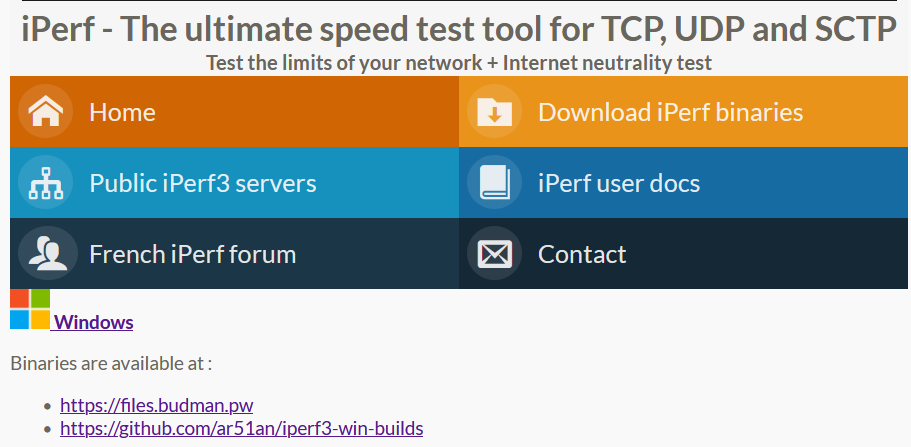
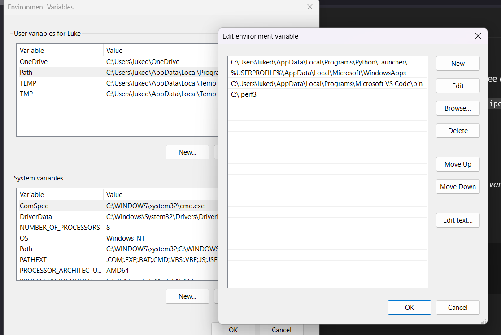
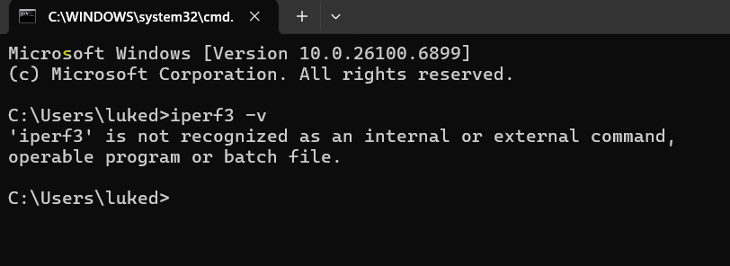
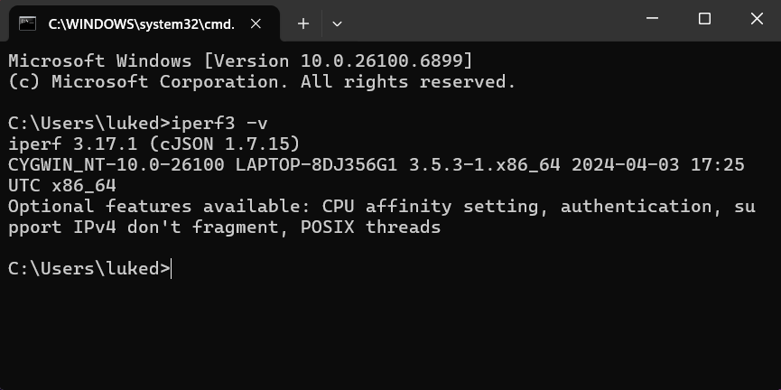

# Measuring Network Latency and Throughput with **iperf3**

## Obectives
The purpose of this lab was to provide hands-on experience with measuring network performance between two devices using iperf3.

- Download iperf3 for windows laptop to run as the server.
- Setup a VM on VirtualBox running Lubuntu to act as the client.
- Install and configure iperf3 on both systems.
- Measure network latency between the two systems.
- Measure network throughput between the client and server.

## Topology  

## Steps

### 1. Download iPerf3  
I downloaded iPerf3 for Windows from the official site:  
  

### 2. Add iPerf3 to PATH  
Initially, I attempted to add `C:\iperf3` to the Windows PATH environment variable, but made a mistake (missed the trailing `\`):  
  

### 3. Test and troubleshoot  
When checking the version, Windows could not recognize the command:  
  

### 4. Fix and validate  
I corrected the PATH to `C:\iperf3\`. After reopening the terminal, `iperf3 -v` worked correctly:  
 
