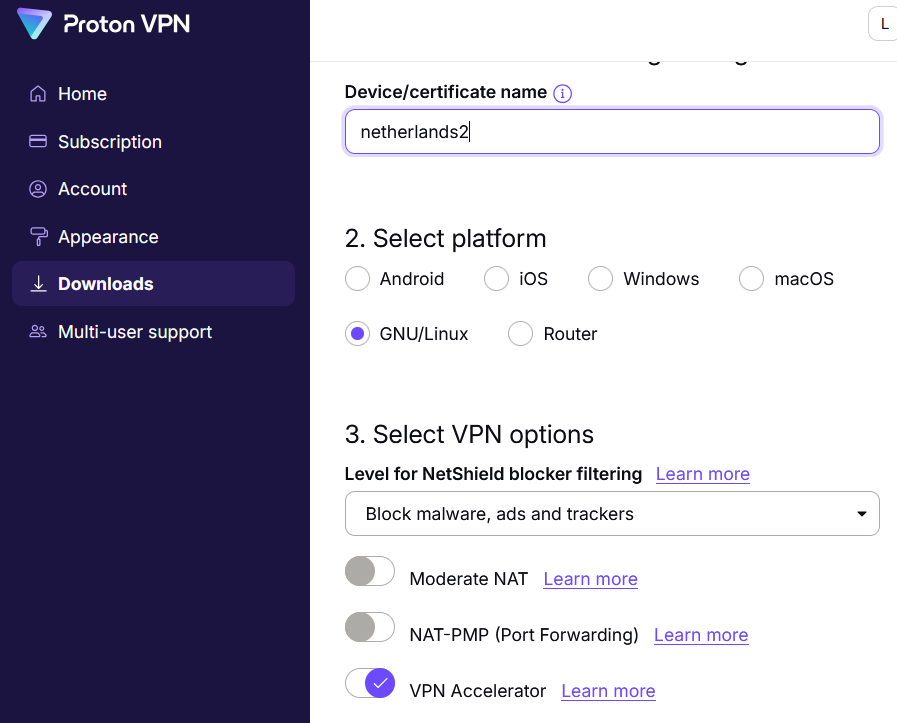
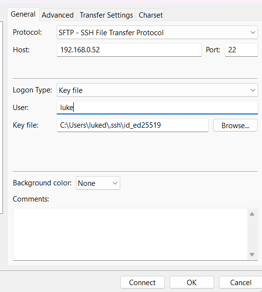
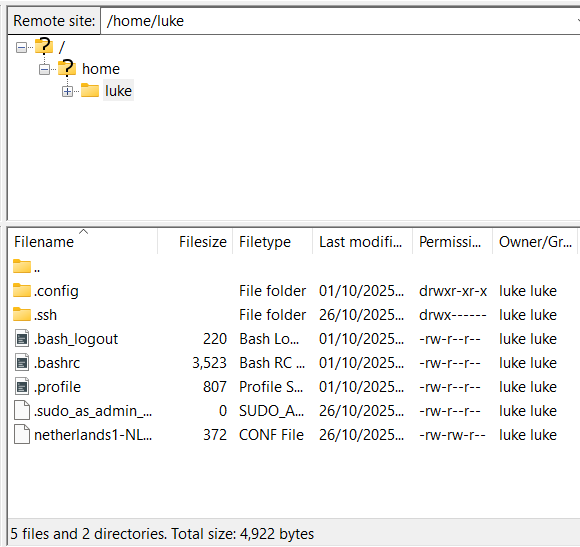
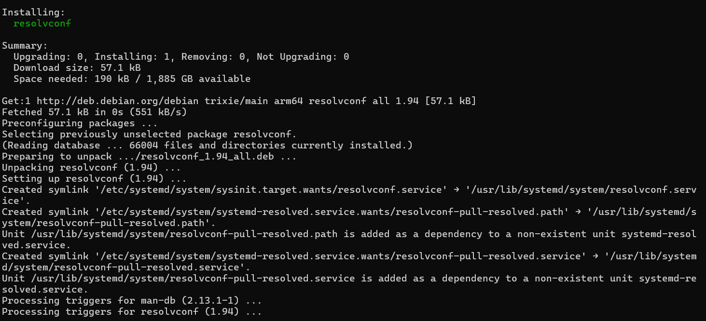
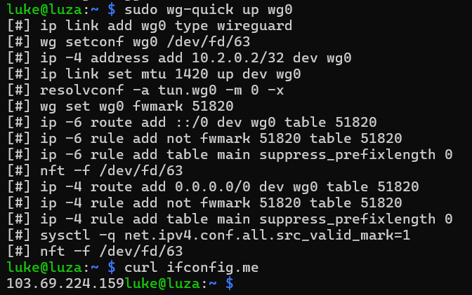

# Raspberry Pi ProtonVPN Setup — Lab 2

## 1. Objective
The aim of this lab was to configure the Raspberry Pi 5 as a ProtonVPN client using **WireGuard** and confirm that its traffic is securely routed through ProtonVPN.  
This builds on the baseline from Lab 1 (SSH + SSD boot) and prepares the Pi for future use as a VPN router.

---

## 2. Equipment
- Raspberry Pi 5 (from Lab 1 setup).  
- ProtonVPN Plus account (required for WireGuard config generation).  
- Laptop/desktop (Windows 11) with:  
  - SSH access to the Pi.  
  - FileZilla client (for file transfer via SFTP).  
- ProtonVPN WireGuard configuration file (Netherlands server).  

---

## 3. Procedure

### Step 1 — Update & Secure the Pi
Keeping the system updated ensures security and compatibility with VPN packages.  
```bash
sudo apt update && sudo apt upgrade -y
```
SSH keys were already configured in Lab 1, so no further changes were required.

---

### Step 2 — Install WireGuard
Installed the WireGuard client tools:  
```bash
sudo apt install wireguard -y
```


---

### Step 3 — Obtain ProtonVPN Config File
From the ProtonVPN dashboard, generated a **Netherlands WireGuard config** named `netherlands1-NL-567.conf`.  
Options selected:  
- Platform: GNU/Linux  
- Protocol: WireGuard (UDP)  
- NetShield: Enabled (ads/malware blocking)  



---

### Step 4 — Transfer Config File to Pi
Used FileZilla with SSH key authentication to securely copy the `.conf` file into the Pi’s home directory.  

  


---

### Step 5 — Configure WireGuard
Moved and renamed the config to the proper directory (`/etc/wireguard/wg0.conf`) so `wg-quick` can use it:  
```bash
sudo mv ~/netherlands1-NL-567.conf /etc/wireguard/wg0.conf
```

---

### Step 6 — Establish VPN Connection
Brought the VPN tunnel online:  
```bash
sudo wg-quick up wg0
```

Initially failed due to missing `resolvconf`. Installed it with:  
```bash
sudo apt install resolvconf -y
```


After retrying, the tunnel came up successfully.  


---

### Step 7 — Verify VPN Routing
Confirmed public IP is now ProtonVPN Netherlands exit server:  
```bash
curl ifconfig.me
```
Output:  
```
103.69.224.159
```

---

## 4. Results
- Successfully connected Raspberry Pi to ProtonVPN via WireGuard.  
- Verified traffic routed through ProtonVPN Netherlands server.  
- Resolved missing dependency (`resolvconf`) during setup.  

---

## 5. Conclusion
The Raspberry Pi 5 is now capable of:  
- Establishing a secure VPN tunnel with ProtonVPN.  
- Routing its traffic through the VPN for privacy.  

This lab represents the first step toward transforming the Pi into a VPN router for the local network.

---

## 6. Key Takeaways
- WireGuard is efficient and well-suited for low-power devices like the Raspberry Pi.  
- FileZilla with SSH keys simplifies secure file transfers.  
- Dependency troubleshooting (e.g., `resolvconf`) is a realistic part of systems administration.  
- Verifying the exit IP ensures that the VPN is functioning as intended.  

---

## 7. Future Work
- **Lab 3:** Configure the Pi with a static LAN IP, set VPN to auto-start on boot, and implement a kill switch.  
- **Lab 4:** Extend functionality to act as a VPN router (subnet, DHCP, NAT).  
- Optional enhancements: integrate **Pi-hole** for DNS filtering, monitoring dashboards, and multiple VPN profiles.  

---

## 8. Topology
*(Placeholder — diagram to be added later)*  

---
