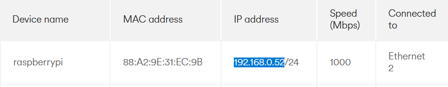

# Raspberry Pi Setup — Enabling SSH and Configuring SSD Boot

## 1. Objective
The aim of this lab was to prepare a Raspberry Pi for use as a headless server by:
- Enabling SSH for remote access.
- Troubleshooting connectivity issues.
- Updating the bootloader to allow SSD boot.
- Flashing and configuring an SSD as the primary boot device.

This work sets the foundation for using the Pi in future labs, such as a VPN router project.

---

## 2. Equipment
- Raspberry Pi 5
- MicroSD card (used for initial boot and bootloader update)
- NVMe SSD in USB adapter/case
- Laptop running Windows 11
- Raspberry Pi Imager v1.9.6 and Balena Etcher
- Ethernet cable and router (for direct connection when Wi-Fi troubleshooting failed)

---

## 3. Procedure

### Step 1 — Flashing the Initial OS
- Used **Raspberry Pi Imager** to flash Raspberry Pi OS Lite (64-bit) onto a microSD.
- Enabled SSH (via advanced settings and by manually adding an empty `ssh` file).
- Created a `wpa_supplicant.conf` file to configure Wi-Fi:

```conf
country=GB
ctrl_interface=DIR=/var/run/wpa_supplicant GROUP=netdev
update_config=1

network={
    ssid="YourWiFiName"
    psk="YourWiFiPassword"
    key_mgmt=WPA-PSK
}
```

- Example screenshot of flashing:  
  

---

### Step 2 — Troubleshooting SSH Access
This stage took significant time. Problems included:
- **ARP scans not showing the Pi’s IP address**:  
  

- **SSH connection refused / timed out** even when IP was known:  
  

- Testing with Ubuntu Server and Balena Etcher also failed due to missing SSH defaults.  
- **Resolution**: checked the router admin panel, which finally revealed the Pi’s IP as `192.168.0.52`.



Once the IP was known, SSH still failed because of stale host keys. Running:
```bash
ssh-keygen -R 192.168.0.52
```
removed the old key and allowed a fresh connection.

---

### Step 3 — Successful SSH Login
- Connected with:
  ```bash
  ssh pi@192.168.0.52
  ```
- Screenshot of first successful login:  
  

---

### Step 4 — Updating Bootloader for SSD
- Checked bootloader version:
  ```bash
  vcgencmd bootloader_version
  ```
  

- Used `raspi-config` → Advanced Options → Boot Order to set **NVMe/USB Boot** as default.


---

### Step 5 — Flashing SSD and Booting
- Flashed SSD with Raspberry Pi OS Lite.
- Rebooted and confirmed Pi now boots directly from SSD with SSH working correctly.

---

## 4. Results
- Pi was successfully configured for SSH access and SSD boot.
- Identified and resolved key problems:
  - Wi-Fi auto-config failures.
  - SSH service not enabled correctly in some flashes.
  - ARP scan not always listing the Pi’s IP.
  - Host key mismatch errors in `.ssh/known_hosts`.

---

## 5. Conclusion
The Raspberry Pi 5 can now:
- Boot reliably from SSD.
- Be managed remotely over SSH.

This lab forms a strong baseline for future networking labs (e.g., setting up VPN services).

---

## 6. Troubleshooting Notes
- **Multiple re-flashes were attempted** with Raspberry Pi Imager and Balena Etcher.
- **Tried Ubuntu Server** — connection issues due to SSH not enabled by default.
- **Firewall/VPN** on the laptop was considered but did not affect SSH.
- Ethernet proved more reliable than Wi-Fi during setup.
