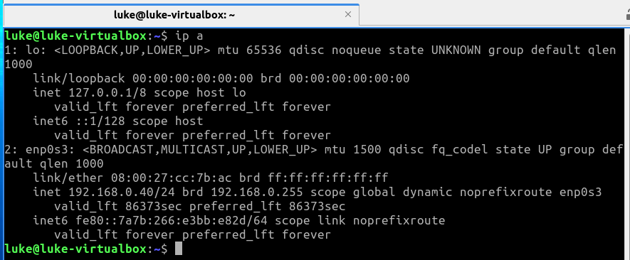
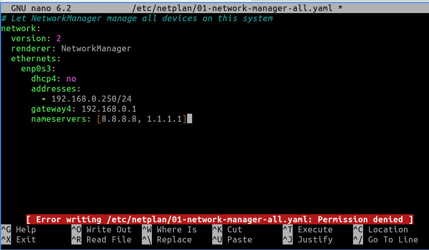
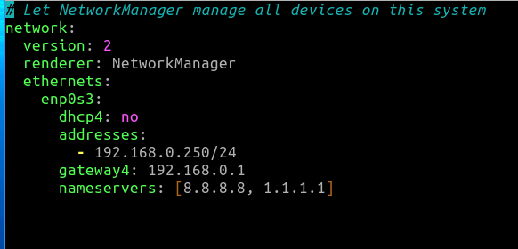
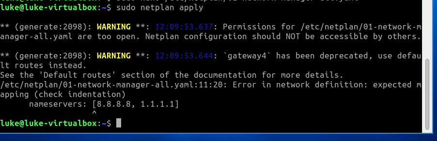
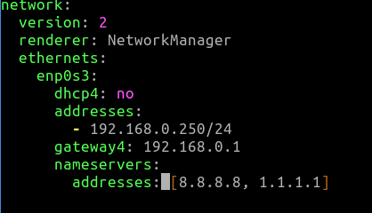
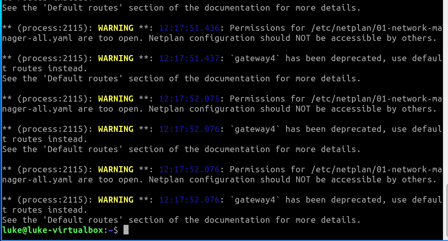

# Configuring a Static IP Address in Linux

## Objectives
- Learn how to configure a static IP address manually in Linux.  
- Understand the differences between DHCP and static addressing.  
- Connect this knowledge to CCST Networking concepts (IP addressing, subnetting, routing).  

---

## Lab Setup
- **Server:** Lubuntu Linux VM (configured with static IP).  
- **Client:** Not used directly (verification via local testing).  
- **Network:** VirtualBox Bridged Adapter.  

**Topology Diagram:**  
  

---

## Steps

### 1. Check Current IP Address (DHCP)  
Started the Lubuntu VM and verified that the network adapter was set to **Bridged** mode in VirtualBox.  
Once the VM was running, used the `ip a` command to check the current IP address.  
Confirmed that the network adapter `enp0s3` received a DHCP-assigned IP address (`192.168.0.40`).  



---

### 2. Update the System  
Ran the following command to ensure the system was up to date with the latest packages and security patches:  

```bash
sudo apt update && sudo apt upgrade
```  

---

### 3. Locate Netplan Configuration File  
Used the following command to list the Netplan configuration files:  

```bash
ls /etc/netplan/
```  

This showed the file `01-network-manager-all.yaml`, which is the one to edit for configuring a static IP.  

  

---

### 4. Attempt to Edit Netplan File (Permission Error)  
Opened the `01-network-manager-all.yaml` file in Nano to configure a static IP address.  
While editing, received a **"Permission denied"** error when trying to save changes.  

This happened because the file was opened without `sudo`, so the editor didn’t have permission to write system configuration files.  

  

---

### 5. Edit Netplan File with Sudo  
Reopened the Netplan config file using:  

```bash
sudo nano /etc/netplan/01-network-manager-all.yaml
```  

Using **sudo** (short for *superuser do*) gives administrator privileges, which are required to edit system files.  

In the configuration:  
- Set `dhcp4: no` → disables DHCP so the IP is not assigned automatically.  
- Assigned a static IP address outside of the DHCP pool (`192.168.0.250/24`) to avoid conflicts.  
- Configured the **gateway** (`192.168.0.1`), which is the router that connects the VM’s network to other networks.  
- Added DNS nameservers (`8.8.8.8`, `1.1.1.1`) for domain name resolution.  

Successfully saved the file after making these changes.  

---

### 6. Incorrect Netplan Configuration  
Attempted to save the following Netplan config:  

```yaml
network:
  version: 2
  renderer: NetworkManager
  ethernets:
    enp0s3:
      dhcp4: no
      addresses:
        - 192.168.0.250/24
      gateway4: 192.168.0.1
      nameservers: [8.8.8.8, 1.1.1.1]
```  

The structure for `nameservers` was not correct, which later caused an error.  

  

---

### 7. Apply Configuration (Error Encountered)  
Ran the command:  

```bash
sudo netplan apply
```  

This produced errors and warnings:  
- **Indentation issue**: The `nameservers` line was not formatted properly.  
- **Deprecation warning**: `gateway4` is outdated (though still works).  
- **Permissions warning**: Netplan file permissions were too open.  

  

---

### 8. Corrected Netplan Configuration  
Updated the Netplan config with the correct `nameservers` indentation:  

```yaml
network:
  version: 2
  renderer: NetworkManager
  ethernets:
    enp0s3:
      dhcp4: no
      addresses:
        - 192.168.0.250/24
      gateway4: 192.168.0.1
      nameservers:
        addresses: [8.8.8.8, 1.1.1.1]
```  

  

---

### 9. Apply Configuration (Warnings Only)  
Ran:  

```bash
sudo netplan apply
```  

This time the configuration applied successfully, but produced warnings:  
- **Permissions too open** → the Netplan file should only be editable by root.  
- **`gateway4` deprecated** → modern configs use `routes:` instead.  

  

---

### 10. Update Gateway to Modern Syntax  
Modified the Netplan configuration to replace the deprecated `gateway4` with the recommended `routes` syntax:  

```yaml
network:
  version: 2
  renderer: NetworkManager
  ethernets:
    enp0s3:
      dhcp4: no
      addresses:
        - 192.168.0.250/24
      routes:
        - to: default
          via: 192.168.0.1
      nameservers:
        addresses: [8.8.8.8, 1.1.1.1]
```  

This removed the deprecation warning about `gateway4`.  

---

### 11. Fix File Permissions  
Adjusted the permissions on the Netplan config file to meet security requirements:  

```bash
sudo chmod 600 /etc/netplan/01-network-manager-all.yaml
```  

- **`chmod`** = “change mode” → used to set file permissions.  
- **`600`** = gives the file owner (root) **read and write** access, but **no permissions** for group or others.  

This ensures only the administrator can modify the Netplan configuration file, removing the warning about “permissions too open.”  

---

### 12. Verify Static IP Configuration  
Ran the command:  

```bash
ip a
```  

Confirmed that the interface `enp0s3` was now assigned the static IP address `192.168.0.250/24`.  

Also verified connectivity by pinging the default gateway:  

```bash
ping -c 4 192.168.0.1
```  

Both tests confirmed the static IP configuration was successful.  

---

## Results  
- Successfully configured a static IP address (`192.168.0.250`) on the Lubuntu VM.  
- Verified that DHCP was disabled and the new IP persisted after applying Netplan.  
- Clean configuration with no warnings or errors after updating syntax and permissions.  
- Verified connectivity with the gateway and confirmed static IP assignment using `ip a`.  

---

## Troubleshooting Notes  
- Initially attempted to edit Netplan without `sudo`, which caused permission errors.  
- YAML indentation mistakes caused configuration errors. Fixed by properly nesting `nameservers`.  
- Resolved warnings by updating deprecated `gateway4` syntax and correcting file permissions.  
- Verified connectivity with gateway and confirmed persistence of static IP after changes.  

---

## What I Learned  
- How to configure a static IP address in Linux using Netplan.  
- Importance of proper YAML syntax and indentation.  
- The role of `sudo` in editing system files.  
- Why correct file permissions and updated syntax prevent warnings and ensure secure configurations.  
- How to validate configuration using `ip a` and `ping`.  

---

[⬅ Back to CCST Labs Index](index.md)
